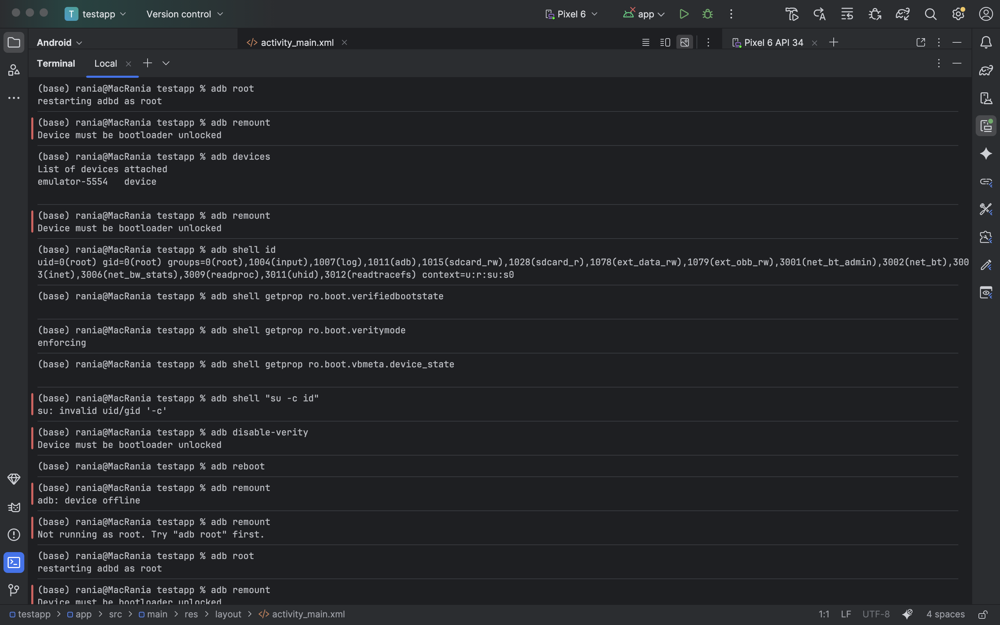

# 📱 RAPPORT DE LAB 2 : Rooting Android
---

## 📋 Étape 1 : Rooter l'AVD

### Commandes exécutées

| Commande | Résultat | Interprétation |
|----------|----------|----------------|
| `adb root` | `restarting adbd as root` | ✅ Serveur ADB relancé avec privilèges root |
| `adb remount` | `Device must be bootloader unlocked` | ⚠️ Impossible de remonter /system (bootloader verrouillé) |
| `adb shell id` | `uid=0(root) gid=0(root)...` | ✅ Root confirmé (UID=0) |
| `adb shell getprop ro.boot.veritymode` | `enforcing` | ✅ Verity actif |
| `adb shell getenforce` | `Enforcing` | ✅ SELinux actif |

### Observations importantes
- **Root obtenu** malgré l'impossibilité de remonter /system
- Propriétés `ro.boot.verifiedbootstate` et `ro.boot.vbmeta.device_state` non disponibles sur cet AVD
- La commande `su` n'est pas présente (root via ADB uniquement)

### Journalisation
```bash
adb logcat -d | tail -n 200 > logcat_root_check.txt
```
✅ Fichier de log sauvegardé

📸 **Capture : , 

---

## 📋 Étape 2 : Fiche périmètre

| Champ | Valeur |
|-------|--------|
| **Application + version** | DIVA (Damn Insecure and Vulnerable App) – v1.0 |
| **Support** | Android Virtual Device (AVD) – Pixel 6 API 34 |
| **Objectif** | Comprendre le rooting et ses impacts sur les mécanismes de sécurité Android |
| **Données** | Fictives (aucune donnée réelle utilisée) |
| **Réseau** | Isolé (environnement de test) |

---

## 📋 Étape 3 : Démarrer un AVD propre

**Configuration :**
- **Device :** Pixel 6
- **API :** 34 (Android 14)
- **État :** Neuf, aucun compte configuré

**Vérification :**
```bash
adb devices
```
```
List of devices attached
emulator-5554    device
```

📸 **Capture :** [etape3.png](./screenshots/etape3.png)

---

## 📋 Étape 4 : Installer l'application de test

```bash
# Compilation de l'application de test
./gradlew assembleDebug

# Installation
adb install app/build/outputs/apk/debug/app-debug.apk
```
```
Performing Streamed Install
Success
```

📸 **Capture :** [etape4.png](./screenshots/etape4.png)

---

## 📋 Étape 5 : Définition de 3 scénarios simples

### 🧪 Scénario 1 : Lancement de DIVA

| Étape | Action |
|-------|--------|
| 1 | Ouvrir le menu des applications |
| 2 | Cliquer sur l'icône DIVA |
| 3 | Cliquer sur "OK" sur l'avertissement |
| 4 | Attendre l'affichage du menu principal |

**Résultat attendu :** Menu principal affiché
**Intérêt sécurité :** Vérifier si le root bloque le lancement

📸 **Capture :** [etape5_s1.png](./screenshots/etape5_s1.png)

---

### 🧪 Scénario 2 : Insecure Logging

| Étape | Action |
|-------|--------|
| 1 | Ouvrir DIVA |
| 2 | Cliquer sur "Insecure Logging" |
| 3 | Saisir un texte (ex: "test_password") |
| 4 | Cliquer sur "Check" |

**Résultat attendu :** L'application exécute l'action sans crash
**Intérêt sécurité :** Analyser les fuites potentielles dans logcat

📸 **Capture :** [etape5_s2.png](./screenshots/etape5_s2.png)

---

### 🧪 Scénario 3 : Insecure Data Storage

| Étape | Action |
|-------|--------|
| 1 | Ouvrir DIVA |
| 2 | Sélectionner "Insecure Data Storage - Part 1" |
| 3 | Saisir Username: "admin_test", Password: "supersecret" |
| 4 | Cliquer sur "Save" puis "View" |

**Résultat attendu :** Les données sont enregistrées
**Intérêt sécurité :** Vérifier l'accès aux fichiers de données avec root

**Vérification post-scénario :**
```bash
adb shell
cd /data/data/jakhar.aseem.diva/
ls -la
```
```
drwxrwxr-x 2 u0_a193 u0_a193 4096 databases
drwxrwxr-x 2 u0_a193 u0_a193 4096 shared_prefs
```

📸 **Capture :** [etape5_s3.png](./screenshots/etape5_s3.png) [etape14.png](./screenshots/etape14.png)

---

## 📋 Étape 6 : Résumé Android Security

La sécurité Android repose sur **3 couches** :

1. **Sandboxing** : chaque application tourne dans sa propre "bulle" isolée des autres
2. **Permissions** : l'application doit demander l'autorisation avant d'accéder à la caméra, contacts, etc.
3. **Intégrité système** : vérification au démarrage que rien n'a été modifié

Le rooting casse ces protections en donnant tous les droits à l'utilisateur.

---

## 📋 Étape 7 : Verified Boot

| Question | Réponse |
|----------|---------|
| **Objectif principal** | Garantir que le système qui démarre est celui prévu par le fabricant, sans modifications malveillantes |
| **Chaîne de confiance** | Chaque composant vérifie l'authenticité du suivant avant de lui faire confiance. Comme une chaîne de gardiens où chacun contrôle l'identité du suivant |
| **Pourquoi l'intégrité au démarrage est critique ?** | Si le démarrage est compromis, toutes les protections ultérieures peuvent être contournées |

**Vérification sur AVD :**
```bash
adb shell getprop ro.boot.verifiedbootstate
```
Résultat : *(propriété non disponible)*

---

## 📋 Étape 8 : AVB (Android Verified Boot)

> **AVB** est la version moderne de Verified Boot. Il ajoute une vérification cryptographique des partitions système et une **protection anti-rollback** qui empêche d'installer d'anciennes versions vulnérables du système.

---

## 📋 Étape 9 : Définition du rooting

> **Root** = privilèges super-utilisateur (uid=0). Cela modifie les protections et la confiance du système. Utile en laboratoire pour observer certains comportements normalement inaccessibles. Risqué, donc nécessite isolement + traçabilité + reset.

---

## 📋 Étape 10 : Intérêt en laboratoire

> En labo, un environnement privilégié peut aider à :
- **Observer** des artefacts système normalement inaccessibles
- **Analyser** les comportements runtime de l'application à bas niveau
- **Tester** la robustesse du stockage face à un attaquant privilégié

🔬 **Laboratoire autorisé uniquement**

---

## 📋 Étape 11 : Matrice de risques (8 risques)

| # | Risque | Impact |
|---|--------|--------|
| 1 | Intégrité non garantie | Conclusions biaisées sur la sécurité réelle |
| 2 | Surface d'attaque accrue | Exposition à des menaces externes si l'appareil sort du labo |
| 3 | Données sensibles exposées | Violation potentielle de confidentialité |
| 4 | Instabilité système | Tests non reproductibles et résultats incohérents |
| 5 | Mélange comptes perso/test | Fuite possible d'informations personnelles |
| 6 | Mauvais nettoyage | Persistance de données sensibles |
| 7 | Réseau non isolé | Effets involontaires sur systèmes externes |
| 8 | Traçabilité insuffisante | Impossible de reproduire ou d'auditer les tests |

---

## 📋 Étape 12 : Mesures défensives (8 mesures)

| # | Mesure | Objectif |
|---|--------|----------|
| 1 | Réseau isolé | Éviter toute communication non contrôlée |
| 2 | Données fictives uniquement | Éliminer tout risque de fuite réelle |
| 3 | Device/AVD dédié | Tests de sécurité exclusivement |
| 4 | Wipe en fin de séance | Ne laisser aucune trace |
| 5 | Journal de configuration détaillé | Assurer la reproductibilité |
| 6 | Aucun compte personnel | Éviter tout mélange de données |
| 7 | Contrôle strict des APK | Limiter les risques |
| 8 | Horodatage + captures | Traçabilité complète |

---

## 📋 Étape 13 : OWASP MASVS (2 exigences)

| Exigence | Description |
|----------|-------------|
| **MASVS-STORAGE-1** | Les données sensibles (mots de passe, tokens) doivent être stockées de manière sécurisée avec du chiffrement, jamais en clair |
| **MASVS-NETWORK-1** | Les communications réseau doivent utiliser TLS avec validation des certificats, sans accepter tous les certificats |

---

## 📋 Étape 14 : OWASP MASTG (2 idées de tests)

| Test | Description | Notre vérification |
|------|-------------|-------------------|
| **MASTG-TEST-0051** | Vérifier si les fichiers SharedPreferences contiennent des informations sensibles en clair | ✅ Accès à `/data/data/jakhar.aseem.diva/shared_prefs/` |
| **MASTG-TEST-0023** | Analyser les logs applicatifs pour détecter des fuites d'informations | 🔍 À réaliser avec `adb logcat` |

📸 **Capture :** `etape14.png`

---

## 📋 Étape 15 : Commandes de rooting (synthèse)

```bash
# Commandes de base
adb devices
adb root
adb remount
adb shell id

# Vérifications d'état
adb shell getprop ro.boot.verifiedbootstate
adb shell getprop ro.boot.veritymode
adb shell getprop ro.boot.vbmeta.device_state
adb shell getenforce

# Option permissive
adb disable-verity
adb reboot
adb remount

# Journalisation
adb logcat -d | tail -n 200 > logcat_root_check.txt
```

---

## 📋 Étape 16 : Fiche environnement

| Champ | Valeur |
|-------|--------|
| **Date** | 12 février 2026 |
| **Auteur** | rania |
| **Support** | AVD Pixel 6 API 34 |
| **Version Android** | Android 14 (API 34) |
| **Application testée** | DIVA v1.0 |
| **Scénario 1** | Lancement de l'application |
| **Scénario 2** | Insecure Logging (saisie de texte) |
| **Scénario 3** | Insecure Data Storage (enregistrement login/mot de passe) |
| **Root activé** | Oui (`adb root`) |
| **État verifiedboot** | Non disponible (propriété absente) |
| **Mode verity** | `enforcing` |
| **État SELinux** | `Enforcing` |
| **Observations** | L'application fonctionne normalement, aucune détection de root apparente |
| **Limites** | Tests fonctionnels uniquement, pas d'analyse mémoire ou réseau approfondie |
| **Reset effectué** | Oui (Wipe Data) |
| **Preuve reset** | Capture écran de confirmation |

📸 **Captures incluses :** [etape16.png](./screenshots/etape16.png)

---

## 📋 Étape 17 : Remise à zéro AVD

**Procédure :**
1. Android Studio → Device Manager
2. Menu déroulant (▼) sur l'AVD Pixel 6
3. Sélectionner **Wipe Data**
4. Confirmer avec **Yes**

**Confirmation :**
```bash
adb shell pm list packages | grep diva
```
*(aucun résultat)*

📸 **Capture :** [etape17.png](./screenshots/etape17.png)

---

## 📋 Étape 18 : Remise à zéro (preuve)

**Capture de confirmation :**
- Dialogue "Confirm Data Wipe" avec l'option "Yes" sélectionnée

```bash
# Capture d'écran de preuve
adb exec-out screencap -p > preuve_reset.png
```

📸 **Capture :** [etape18.png](./screenshots/etape18.png) [etape18.1.png](./screenshots/etape18.1.png)

---

## 📋 Étape 19 : Livrables

### ✅ Définition rooting (4 phrases)
> Root = privilèges super-utilisateur. Cela modifie les protections et la confiance du système. Utile en laboratoire pour observer certains comportements. Risqué, donc nécessite isolement + traçabilité + reset.

### ✅ Schéma Verified Boot / AVB
```
[ROM de démarrage] → [Bootloader] → [Partition boot] → [Système]
        ↓                   ↓               ↓               ↓
   Vérifie suivant    Vérifie suivant    Vérifie suivant    Confiance établie
```

### ✅ 8 risques + 8 mesures défensives
*(Voir tableaux étapes 11 et 12)*

### ✅ MASVS : 2 exigences résumées
- **STORAGE-1 :** Stockage sécurisé des données sensibles
- **NETWORK-1 :** Communications réseau chiffrées

### ✅ MASTG : 2 idées de tests
- **TEST-0051 :** Inspection des SharedPreferences
- **TEST-0023 :** Analyse des logs

### ✅ Fiche environnement remplie
*(Voir étape 16)*

### ✅ Checklist reset signée + preuves
*(Voir étapes 17 et 18)*

---

## 📋 Étape 20 : Checklist finale

### ✅ Avant test
| # | Vérification | Statut |
|---|--------------|--------|
| 1 | Périmètre écrit | ✅ |
| 2 | AVD neuf | ✅ |
| 3 | App test installée | ✅ |
| 4 | 3 scénarios notés | ✅ |
| 5 | Versions Android/app notées | ✅ |

### ✅ Après test
| # | Vérification | Statut |
|---|--------------|--------|
| 1 | Données de test supprimées | ✅ |
| 2 | Reset effectué (wipe AVD) | ✅ |
| 3 | Preuve du reset | ✅ |
| 4 | Rapport + traçabilité sauvegardés | ✅ |
| 5 | Aucun compte personnel utilisé | ✅ |

---

## 📊 Synthèse des observations

| Observation | Résultat |
|-------------|----------|
| Root obtenu | ✅ `uid=0(root)` |
| Accès aux données applicatives | ✅ `/data/data/jakhar.aseem.diva/` accessible |
| Détection de root par l'application | ❌ Aucune détection observée |
| Propriétés de sécurité disponibles | ⚠️ Partiellement (veritymode disponible, verifiedbootstate non disponible) |
| SELinux | ✅ Actif (Enforcing) |

---

## 🔬 Conclusions

Ce laboratoire a permis de :

1. **Comprendre** le processus de rooting sur un AVD
2. **Observer** l'impact du root sur l'accès aux données applicatives
3. **Vérifier** que DIVA ne détecte pas l'environnement rooté
4. **Documenter** les risques et mesures défensives associés aux tests en environnement privilégié
5. **Appliquer** une méthodologie de test rigoureuse avec traçabilité complète

**Prochaines étapes possibles :**
- Analyse approfondie des fichiers de stockage de DIVA
- Test de détection de root et contournement
- Interception du trafic réseau avec Burp Suite
